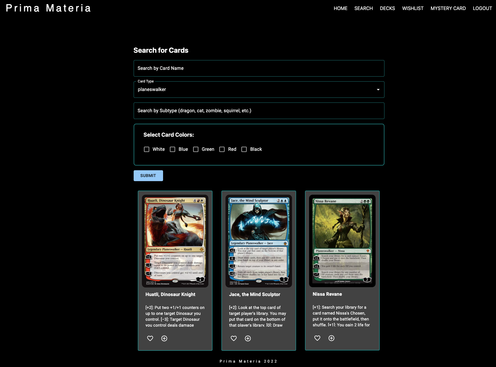

# Prima-Materia

## Links
View the deployed app: 
## Screenshot
    
## Table of Contents:
#### [Description](#description)
#### [Technology](#technology)
#### [Usage Info](#usage-info)
#### [Contribution Guidelines](#contribution-guidelines)
#### [Kudos](#kudos)
#### [Questions](#questions)

## Description
Prima-Materia is an application for users who love Magic the Gathering. It utilizes a community MTG API (https://magicthegathering.io) and allows users to create an account, manage a wishlist, build decks, and complete refined searches. Prima-Materia was created with React and utilizes GraphQL API practices.
    
## Technology
Node, React, Apollo, GraphQL, MongoDB, Mongoose, Bcrypt, JWT, Express, and Material UI.

## Contribution Guidelines
if you would like to contribute or play around with the application, please create a fork from the main branch, https://github.com/bordanattila/Prima-Materia. Install it on your device and be sure to do an `npm install` from the root file.  Contact any of the developers below with questions or to ask us about reviewing your changes!

## Kudos
Thanks to https://magicthegathering.io for the wonderful and easy to access API! Thanks to all the people at Material UI for the top-notch documentation. Thanks to everyone who contributed and everyone who helped troubleshoot as we got this application live!

## Questions
If you have questions please contact any of the developers listed: Reed Meher / reed@meherdevs.com
Check out more of our work on Github at [archonology](https://github.com/archonology).
    
## Badges

